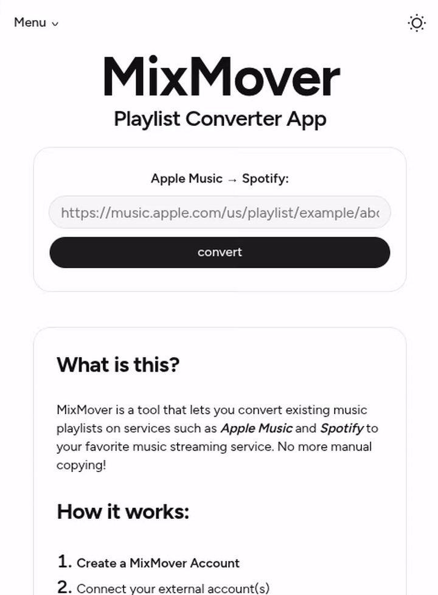

# MixMover


### For when your friend keeps sending you those dang Apple Music links

**MixMover** is a web app that converts a music playlist from one service to another. I built this project to showcase my full-stack development skills as well as personal use and the use of anyone looking for such a tool.

🔗 [Live Demo](https://mixmover.macook.dev)




## Features

- Secure, session based MixMover account management
- Saves converted playlist directly to your Spotify Account
- Clear feedback on conversion status
- Securely handles external Spotify account information using [OAuth Authorization Code Flow](https://developer.spotify.com/documentation/web-api/concepts/authorization), tokens are scoped and session-based
- Responsive design for mobile and desktop resolutions
- Light and Dark theming for your eyeballs

## Current Limitations

- Conversions only work from Apple Music -> Spotify. This is due to the current Apple Developer fee which restricts access to their API. I intend in the future to implement the Spotify -> Apple Music conversions.
- Spotify App is currently in [Development Mode](https://developer.spotify.com/documentation/web-api/concepts/quota-modes). Only users who are authorized in the Development Dashboard can use the Spotify features of the web app. Graduating from Development Mode to Extended Quota Mode requires an application sent to Spotify and organizational overhead, which is outside the scope of this project.

## Quickstart Prod Deployment

```bash
# Create directory structure with proper permissions
mkdir -m 764 -p mixmover/server/data
cd mixmover
```

> [!NOTE] 
> Your `.env` must exist at `mixmover/server` in order to run the program 

```bash
# Copy compose.prod.yml
curl -O https://raw.githubusercontent.com/matterladd/Mix-Mover/refs/heads/main/compose.prod.yml

# Run with Docker Compose
sudo docker compose -f compose.prod.yml up
```
See more in [deployment.md](./deployment.md)

## Dev Installation

This project is a [monorepo](https://en.wikipedia.org/wiki/Monorepo) organized into three `npm` project domains: the _client_, _server_, and the _overall/top-level_. Running top-level runs the whole application, while running only the client or server will run that part of the stack. To install for development:

```bash
# Clone this repository
git clone https://github.com/matterladd/Mix-Mover.git

# Install dependencies
cd Mix-Mover
npm install

cd ./client
npm install

cd ../server
npm install

# Run the whole app
cd ..
npm run dev
```

## Tech Stack:
- See more in [architecture.md](./architecture.md)

### Languages
- TypeScript

### Client

- `react` -> Frontend library
- `react-router-dom` -> Provides client-side routing, which allows this project to be a [single page application](https://en.wikipedia.org/wiki/Single-page_application)
- `vite` -> Frontend development server
- `tailwindcss` -> Custom CSS class library
- `shadcn` -> Pre-styled React components using the [BaseUI](https://base-ui.com/) library

### Server

- `express` -> Backend API routing framework
- `express-session` -> Express middleware extension to store active session information
- `cookie-parser` -> Parses the short-lived signed cookie used during the OAuth handshake
- `better-sqlite3` -> Node integration with a SQLite database
- `better-sqlite3-session-store` -> Stores user data across different sessions by integrating with `express-session`
- `bcrypt` -> Hashing algorithm used to securely store local MixMover account passwords
- `playwright` -> Headless browser (Firefox) library that is used for web scraping Apple Music for playlist data, since no public API is available.
- `bottleneck` -> Handles API rate limiting for outside API requests

## File Structure

### `./client`

- `pages/`: All top-level React page components.
- `components/`: All non-top-level React components.
    - `ui/`: Shadcn components.
- `context/`: All React contexts needed by the application

### `./server`

- `src/`
  - `api_routes/`: Contains _Express_ routes that are responsible for handling requests geared towards a certain API.
  - `services/`: Helper functions that may interact directly with an external API. Used in various _Express_ routes.
  - `auth_routes/`: _Express_ routes that handle user authentication.
  - `db/`: Contains external database connection, queries, and database setup/creation.
- `data/`: Must exist when running (Docker image has this preconfigured) and may contain a SQLite database file. A database file will be created if one does not exist.

## API Endpoint Groups

- See more in [architecture.md](./architecture.md)
- Backend Routes:
  - `/api`: Root of all backend services.
  - `/api/auth`: Contains all routes having to do with MixMover account authorization.
  - `/api/spotify_auth`: Contains all routes having to do with Spotify account authorization.
  - `/api/app`: Contains all routes that concern MixMover data.
  - `/api/spotify`: Contains all routes that concern Spotify data. Where most of the Spotify API calls live.
- Backend errors will return `{ error: "message" }` to the frontend.

## Docs
- [architecture.md](./architecture.md)
- [deployment.md](./deployment.md)
