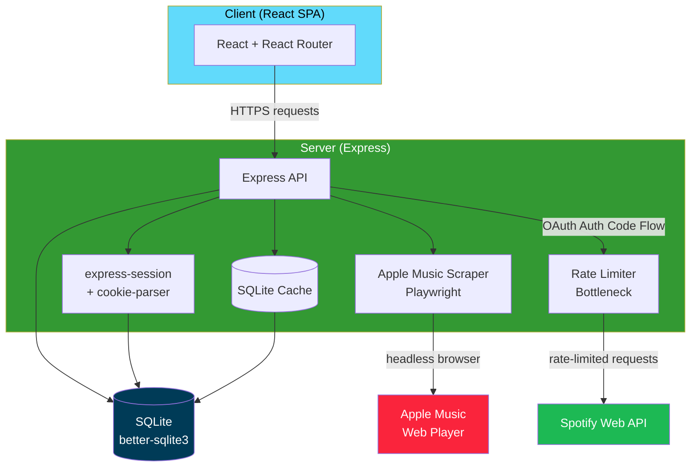
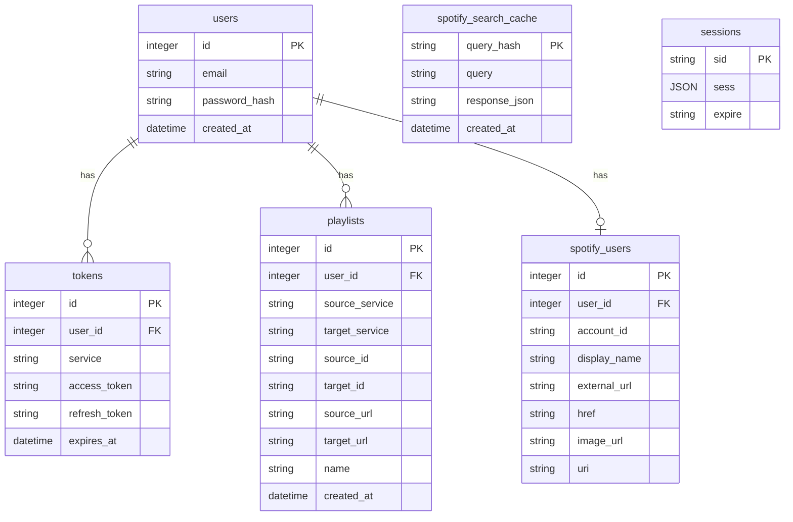

# Architecture

## Overview

This project is a [monorepo](https://en.wikipedia.org/wiki/Monorepo) organized into three `npm` project domains: the _client_, _server_, and the _overall/top-level_. This is to allow flexibility with future deployments where deploying the frontend and backend separately may be necessary. In addition, it keeps a logical organization to the project.

Here you can see the basic structure of the app. The Express API can be seen as the "hub" of the app, where all requests are managed and delegated. The server maintains connections to a SQLite database that exists externally of the project and a single running instance of a Playwright Firefox browser used for web scraping.

## Frontend Architecture

The frontend is designed as a React Single Page Application. This was chosen for an improved user experience with page load times, easier state management, and faster UI responses to user actions.

### Route Layout

- `/`: Home Page. Contains conversion button and instructions on how to use the site.
- `/login`: Login Page. Used to assign a session to the user.
- `/signup`: Sign Up Page. Used to create a new user in the system and assign a session.
- `/account`: Account Page. Accessible to users who have a valid session. Contains actions that modify the MixMover account, such as connecting an external account, deleting the MixMover account, and logging out of the session.

### State Management

There are three main React _Contexts_ that provide consistent state throughout the app:

- `AuthContext`: Provides user information
- `SpotifyContext`: Provides Spotify information linked to the user
- `ThemeContext`: Provides theme information for light and dark styles

In addition, all forms (login, signup, conversion, etc...) follow the _controlled component_ pattern, where the inputs to all fields are stored in the given form component's state.

### Patterns

The frontend follows the Tailwind philosophy of _moblie-first_ styling, with breakpoints for responsive UI at different screen sizes.

It also makes use of _shadcn/BaseUI_ components as much as possible to create a uniform style language while following best accessibility practices.

Finally, all actions that require feedback to the user make use of the _Sonner toast_ component library, which provides loading, success, and error feedback on conversions, logins, account deletions, etc.

## Backend Architecture

### Session management

Sessions are managed through cookies signed by `express-session` and persisted to storage via `better-sqlite-session-store` middleware. Session cookies are `httpOnly` and `strict` which minimizes their usable scope apart from basic authentication. `secure` is set to `false` to deal with the deployed container communicating internally with the Cloudflare Tunnel. In practice, all frontend traffic is sent to the backend via HTTPS through the tunnel, which is why this setting is secure.

In the OAuth Authorization Code Flow for connecting Spotify accounts, a new, temporary cookie is created with `httpOnly`, `secure`, and `lax` permissions to store the `state` variable across site redirects. This cookie is only used once for protection against CSRF attacks.

### Error Handling

Errors are handled via a custom catch-all Express error handler, which catches any errors thrown at any point in the middleware functions and returns a HTTP 500 message with sanitized details about the error, while more detailed messages are logged on the backend console.

Certain errors such as login errors have their own custom responses to the frontend with HTTP 400 messages.

All error messages sent to the frontend do not give system details and only provide the minimal needed context about what is causing the error.

### Caching Strategy

Caching is done on Spotify song search results to help with conversion speed and reduce the traffic sent to the Spotify API. Results are stored in the `spotify_search_cache` table, detailed in [Database Schema](#database-schema).

### API Endpoints

#### App API Group

| Method | Endpoint      | Description                                                 |
| ------ | ------------- | ----------------------------------------------------------- |
| GET    | `/api/app/me` | Returns current MixMover user information based on session. |

#### Spotify API Group

| Method | Endpoint                     | Description                                                                                                                                 |
| ------ | ---------------------------- | ------------------------------------------------------------------------------------------------------------------------------------------- |
| GET    | `/api/spotify/me`            | Returns current Spotify account information for the given MixMover user based on session.                                                   |
| POST   | `/api/spotify/convert-apple` | Returns a Spotify playlist link that has been converted from a provided Apple Music link. Saves Spotify Playlist to user's Spotify account. |

#### App Auth

| Method | Endpoint           | Description                                     |
| ------ | ------------------ | ----------------------------------------------- |
| POST   | `/api/auth/login`  | Uses credentials to set session status          |
| POST   | `/api/auth/logout` | Destroys session                                |
| POST   | `/api/auth/signup` | Creates new user in database and sets session   |
| POST   | `/api/auth/delete` | Deletes user from database and destroys session |

#### Spotify Auth

| Method | Endpoint                     | Description                                                                                               |
| ------ | ---------------------------- | --------------------------------------------------------------------------------------------------------- |
| POST   | `/api/auth/spotify`          | Begins the OAuth Authorization Code Flow for Spotify account connection, redirects to Spotify             |
| POST   | `/api/auth/spotify/callback` | Where Spotify redirects back to with the authorization code. API token is fetched and stored in database. |

### Database Schema

SQLite was chosen for this project because of its lightweight, portable, file-based nature. SQLite is configured with `foreign_keys = ON` to add relationships between tables, and `journal_mode = WAL` to allow for multiple concurrent reads and a single write, greatly improving performace under load.

Additionally, cascading deletes are implemented on a user's deletion, so that all foreign keys that relate to the user are deleted as well, keeping records lean and preventing orphans.

## Request Flow

### Conversion

1. Link is sent to `/api/spotify/convert-apple` from frontend home page
2. Endpoint verifies user has valid session, connected Spotify Account, and a valid Spotify API token
3. Link is sent to Playwright browser and is scraped for song titles and artist names
4. Each song is batched in search requests to the Spotify API to get necessary data to add the songs to a new playlist. Rate limits are obeyed and search requests are resent after a specified time if they are rate limited.
5. A new Spotify playlist is created on the user's Spotify Account
6. Songs are added to the playlist
7. Response to frontend request is fulfilled, the playlist's external URL is sent to the frontend for display to user

## Development Tools

### Project

This project is set up with VS Code users in mind. There is a workspace file located in the root that allows developers easy access to all three project domains. In addition, [ESLint](https://eslint.org/docs/latest/) and [Prettier](https://eslint.org/docs/latest/) are configured for TypeScript rule enforcement and formatting consistency respectively.

### Client

Development of the frontend uses [Vite](https://vite.dev/guide/), which has many nice features including hot-reloading frontend changes, a builder/compiler, and broad user support. In the `vite.config.ts` file, `/api` is proxied to `127.0.0.1:3000`, which is where the development backend runs by default. This allows testing changes to the full stack fast and easily.

### Server

Development of the backend uses `nodemon` while running the Express app for hot-reloading changes to backend code.

## Deployment Architecture
The current active deployment uses a Cloudflare Tunnel to provide the app with a URL accessible from anywhere, and a Docker image that contains the full stack application. Details on configuration can be found in [deployment.md](./deployment.md).